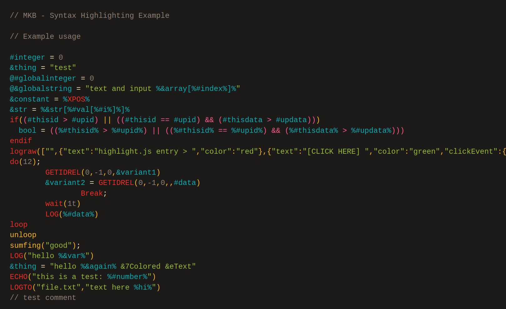

# Macro Keybind mod scripting language (MKB) - a language grammar for [highlight.js](https://highlightjs.org/)

## Demo

The below screenshot was captured from the [demo webpage](docs/demo.html).



## Usage

Simply include the Highlight.js library in your webpage, then load this module.

### Static website or simple usage

Simply load this module after loading Highlight.js. You'll use the minified version found in the `dist` directory. This module is just a CDN build of the language, so it will register itself as the Javascript is loaded.

```html
<script type="text/javascript" src="/path/to/highlight.min.js"></script>
<script
  type="text/javascript"
  src="/path/to/highlightjs-mkb/dist/mkb.min.js"
></script>
<link rel="stylesheet" href="/path/to/highlightjs/styles/default.min.css" />
<script type="text/javascript">
  hljs.initHighlightingOnLoad();
</script>
```

For more details of the usage see [Highlight.js main page](https://github.com/highlightjs/highlight.js#highlightjs).

## Authors

[Dereavy](https://github.com/Dereavy)

## Contribution

Feel free to create issues or (even better) pull requests.

A good starting point for how to build and test your changes locally is [here](https://github.com/highlightjs/highlight.js/blob/master/extra/3RD_PARTY_QUICK_START.md).

## Links

- The official site for the Highlight.js library is <https://highlightjs.org/>.
- The Highlight.js GitHub project: <https://github.com/highlightjs/highlight.js>
- Learn more about MKB: <https://www.minecraftforum.net/forums/mapping-and-modding-java-edition/minecraft-mods/1275039-macro-keybind-mod>
